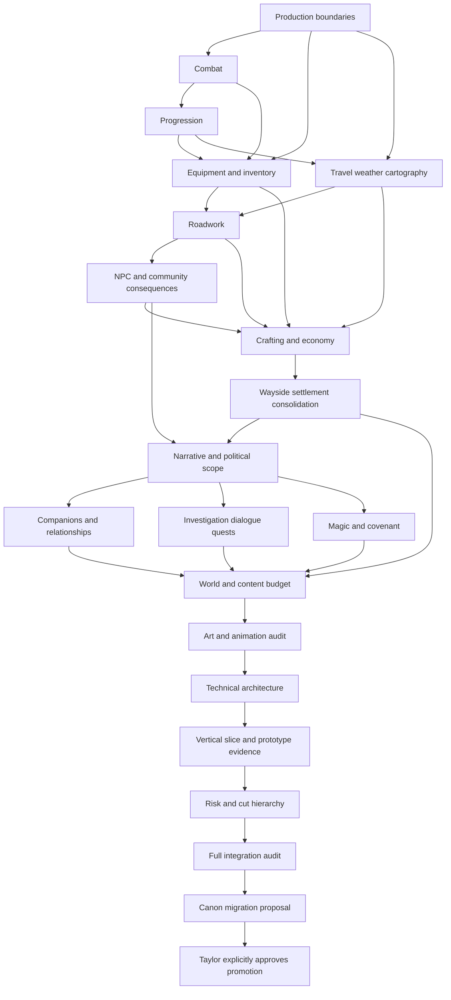

# Wayside — Production Audit Dependencies and First Convergence

**Status:** Working audit coordination; not canon.
**Baseline inspected:** initial block at `52a229f8def22b4fb865eb5afd8ce54d254d4de7`; full remaining audit resumed from repository main tree `7b7439bbc8d34114747f4cb427376b90d3221b13`.
**Scope of this update:** Full Production Edition paper audit through Integration and Canon Migration Proposal. Prototype gates remain unexecuted.
**Approval:** The [Blueprint](../../Wayside_Game_Design_Blueprint_v0.1.md) remains canonical. Taylor's explicit approval is required for any promotion under [migration criteria](canon-migration-criteria.md).

## 1. Recovered dependency decision

The referenced discussion, *Continue Wayside Art Discussion* (`6aa1846a-837c-83e8-aa1e-4ab948f1180a`), contains an early diagram that places Economy before Settlement and an explicit later sequencing correction: **Equipment + Travel → Roadwork → NPC consequences → Economy**. This document follows the final correction. A useful economy should support actual project and community needs rather than generate a reason for simulated trade to exist.

**Hard dependency:** upstream decisions must be reconciled before the downstream pass can lock. **Soft dependency:** drafting may proceed, but the downstream result must be checked after the upstream decision changes. A working interface may be stable enough for the next paper pass while its feel remains Open; this does not make it canon.

Solid arrows express prerequisite reconciliation for a locked downstream specification, not a requirement to postpone every draft. Art and technical feasibility review run throughout; their final audits still follow the actual content budget. The slice planning document can be drafted before playable evidence exists, but must never mark implementation or feel gates passed on that basis. The project's adoption of a working proposal remains a separate approval step after this graph.

## 2. Current status and parallel work

| Work | Paper status | Dependency / next evidence |
|---|---|---|
| [Boundaries](production-edition-boundaries-pass-02.md), [combat](combat-production-pass-01.md), [progression](progression-production-pass-01.md) | Existing working inputs read; unchanged | Their original prototype uncertainties remain |
| [Equipment & Inventory](equipment-inventory-production-pass-01.md) | First pass drafted; cross-pass review completed | E1–E6 not run; final values depend on combat/travel/economy |
| [Travel/Weather/Cartography](travel-weather-cartography-production-pass-01.md) | First pass drafted in parallel with Equipment | T1–T6 not run; time/recovery/route rules need downstream checks |
| [Roadwork & Infrastructure](roadwork-infrastructure-production-pass-01.md) | First convergence drafted and reviewed | P1–P6 not run; NPC and Economy must define actual commitments/reactions |
| [NPC/community consequences](npc-community-consequences-production-pass-01.md) | Paper pass complete | N1–N4 untested; 28-character target, authored witnesses/shared states |
| [Crafting/Economy](crafting-economy-production-pass-01.md) | Paper pass complete | F1–F5 untested; price bands, fixed recipes/refits, cargo ledger |
| [Wayside settlement](wayside-settlement-production-pass-01.md) | Paper pass complete | S1–S4 untested; seven functions, four choices, 12 visual deltas |
| [Narrative/politics](narrative-political-scope-production-pass-01.md) | Paper pass complete | Q1–Q4 untested; three acts, three blocs, four ending variants |
| [Companions/relationships](companions-relationships-production-pass-01.md) | Paper pass complete | A1–A4 untested; two companions, friendship baseline |
| [Investigation/dialogue/quests](investigation-dialogue-quests-production-pass-01.md) | Paper pass complete | I1–I5 untested; bounded evidence grammar and quest FSMs |
| [Magic/covenant](magic-covenant-production-pass-01.md) | Paper pass complete | M1–M5 untested; witness resonance, three covenant Techniques max |
| [World/content budget](world-content-budget-production-pass-01.md) | Paper pass complete | W1–W4 untested; two regions and multidisciplinary package ledger |
| [Art/animation audit](art-animation-production-audit-pass-01.md) | Paper pass complete | V1–V5 untested; tiered hybrid-art pipeline |
| [Technical architecture](technical-architecture-production-pass-01.md) | Paper pass complete | X1–X6 untested; event-driven domains, stable IDs, save transactions |
| [Vertical slice](vertical-slice-production-plan-01.md) | Paper plan complete | No playable implementation; staged evidence gates defined |
| [Risk/cut hierarchy](risk-cut-hierarchy-production-pass-01.md) | Paper pass complete | Apply at slice/production review gates |
| [Full integration audit](full-integration-audit-production-edition-01.md) | Complete on paper | Internally compatible; not production-validated |
| [Canon Migration Proposal](canon-migration-proposal-production-edition-01.md) | Prepared; awaiting Taylor | Canon untouched; explicit approval required |

Roadwork foundations could be drafted during the opening parallel passes, but their final interface was reconciled after both delivered. NPC presentation can likewise be sketched alongside project iteration. Prices, schedule consequences, and content allocations cannot be locked while their inputs remain unspecified. The same applies to art/technical notes: early feasibility is useful, final approval is not implied.

## 3. Decisions this block passes forward

| Responsibility | Working decision | Boundary against accidental scope growth |
|---|---|---|
| Possessions | Durable items; one outfit, weather capability, small owned tool list, one personal pack | No independent armor-layer simulation or new mastery web |
| Prepared combat | Use existing combat families/profiles and two equipped Techniques | Weapon swap, quick slots, ammunition feel stay Open |
| Expedition preparation | Equipment stores provisions; Travel forecasts and requests event consumption | No duplicate deductions; no companion/animal hunger loops |
| Travel | Authored graph plus active local sites; brief routine returns; sourced map knowledge | No extra procedural event catalogue or third region |
| Environmental pressure | Coarse time/events and bounded weather trials | No unannounced real-time project/quest failure or hidden accuracy penalties |
| Construction needs | Roadwork owns material, rights, expertise, and delivery commitments | Cargo is not carried inventory; tools do not substitute for knowledge/consent |
| Access | Explicit foot/light-delivery/heavy-delivery eligibility | No simulated vehicle entities or owned transport lifecycle |
| Consequences | Project outcome updates actual route revision; observation/report updates knowledge | No automatic omniscience or every-NPC global reaction |
| Project breadth | Six major projects, two or three approaches each, one active operation | No generic reconstruction/delegation/module pipeline; smaller totals allowed |
| Visible payoff | A changed site/approach plus affected people and access/supply/covenant effect | Outcomes require budgeted assets and evidence; a ledger flag is insufficient |

The Roadwork crossing is a prototype candidate, not an extra allocation or a decision to canonize Riverfields as one of the two release regions. The next narrative/content passes own final assignment. Its three outcomes include the non-restoration approach; they are not three builds plus an uncounted fourth state.

## 4. Unresolved decisions with real downstream effects

- **Inventory friction:** E3/E4 compare care and weight against their simpler fallbacks. Economy must work without a mandatory repair tax or repeated carrying trips.
- **Combat preparation:** E1/E2/E5 remain subordinate to combat evidence. No animation, HUD, or encounter can assume a second weapon set has been earned.
- **Travel pressure:** T1/T2 decide interruption cadence, provisions and fatigue. Roadwork must remain viable with no persistent fatigue.
- **Time and weather:** T3/T4 allow story milestones and route-only weather as fallback. NPC/Economy cannot require per-frame schedules, hidden deadlines, or universal weather coupling.
- **Map knowledge:** T5 must establish readable distinctions between observed and reported information. Project effects update actual state once; the player's journal must explain what they know.
- **Physical stewardship:** P1/P2/P4 test intervention and visible change. The shared ledger is a proposal, not proof that the central experience works.
- **Content reproducibility:** P5 requires a second project using the first one's template before six-project production. P6 waits for actual cast and supply allocation.
- **State recovery:** E/T/P acceptance cases need one integrated save/transaction exercise; do not maintain three incompatible implementations of resource ownership.

Each pass records its exact latest production gate and fallback. No calendar production schedule was supplied, so deadlines are named milestones. None of these tests has been executed by this documentation audit.

## 5. First-convergence review findings

The review checked the three passes against the existing Blueprint, production ceilings, specialized combat/progression decisions, and migration criteria. It corrected the Roadwork reference to the Blueprint's already-limited module placement, clarified delivery access granularity, and retained prototype status where paper decisions cannot settle feel.

The major proposals each include real-game references and a design source, with what is borrowed, rejected, and unsupported by the reference's production circumstances. Equipment compares Bastion and Outward; Travel compares Roadwarden and 80 Days; Roadwork compares Death Stranding and Pentiment. The proposed systems are our adaptations, not claims that those games use the same state architecture.

This block creates only working documents. Existing canonical and earlier working files are preserved. The final Integration Audit must later resolve all remaining system interfaces and aggregate production costs; the Canon Migration Proposal must map the entire Blueprint, not merely the sections examined here. Taylor's explicit promotion approval remains outstanding.
